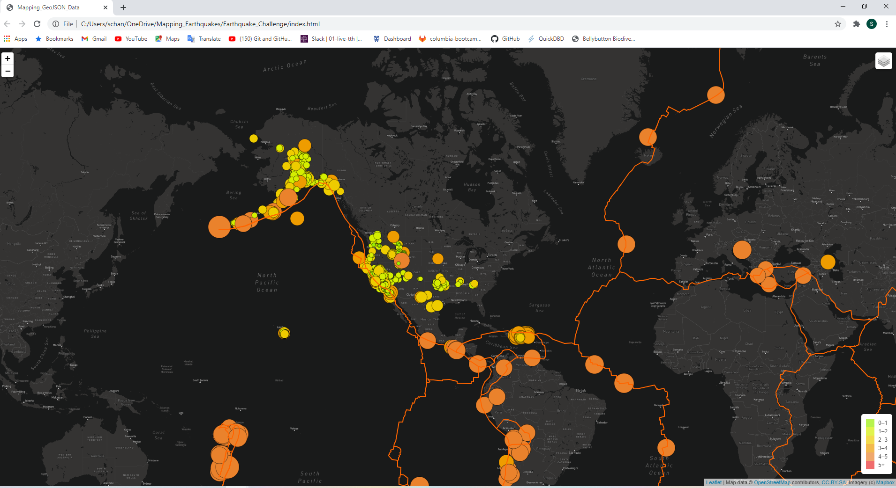

# Mapping_Earthquakes

This project shows:
 - Earthquake data in relation to the tectonic plates’ location on the earth.
 - All the earthquakes with a magnitude greater than 4.5 on the map.
 - Earthquake data being displayed on a third map.
 
 The final map result is:
 
 

